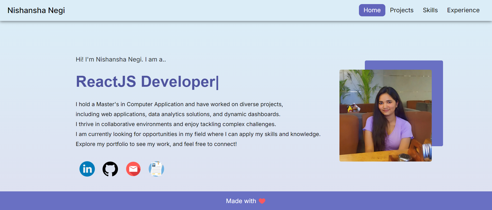

# Nishansha Portfolio

Welcome to my portfolio! This project showcases my skills and projects as a software developer, built using React and Bootstrap. It serves as an online representation of my work and experiences in the tech industry.

## Table of Contents

- [Demo](#demo)
- [Features](#features)
- [Technologies Used](#technologies-used)

## Demo

You can view the live demo of my portfolio at [Nishansha Portfolio](https://nishanshanegi.github.io/Nishansha-Portfolio).

## Features

- Responsive design for all device sizes
- Interactive components using React
- Smooth navigation using React Router
- Clean and modern UI built with Bootstrap

## Technologies Used

- **React**: A JavaScript library for building user interfaces.
- **Bootstrap**: A popular CSS framework for responsive design.
- **GitHub Pages**: For hosting the portfolio.

